# Week5_힙(Heap)

## <힙Heap 정의>

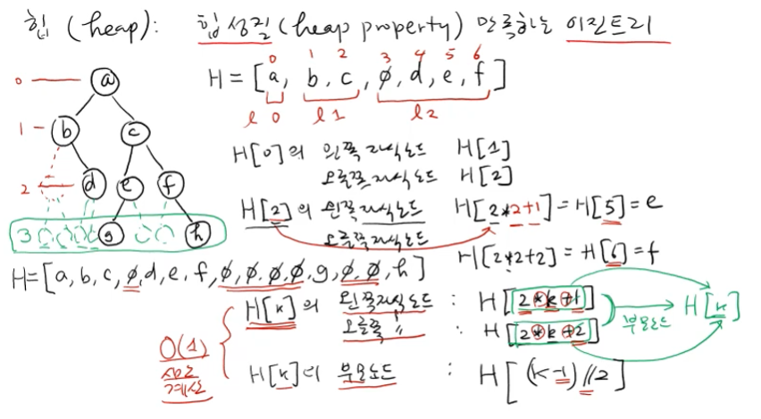

- 힙 성질(heap property)을 만족하는 이진트리(자식 노드를 최대 두개까지 가질 수 있음)

- 이진트리를 표현할 수 있는 방법 3가지 중 첫번째 방법(level by level)
  
  - 모든 노드를 표시하되, 빈 노드는 None으로 처리
  
  - 각각의 레벨에 있는 노드들이 왼쪽부터 연속적으로 리스트에 배치됨
  
  - 장점 : 어떤 노드의 부모/자식 노드를 쉽게 계산할 수 있음
    
    - H[k]의 **왼쪽자식** 노드 : **H[2k+1]** / H[k]의 **오른쪽자식** 노드 : **H[2k+2]**
    
    - H[k]의 **부모노드** : **H[(k-1)//2]**
    
    - 상수시간의 연산으로 왼쪽오른쪽자식노드/부모노드를 계산할 수 있다
  
  - 단점 : 빈 노드가 많을 경우 불필요한 공간(메모리) 낭비
  
  - 이런 메모리 낭비 없이 모든 레벨의 노드가 꽉꽉 차 있는 이진트리를 첫번째 방법으로 표현한 것을 힙이라고 한다! 물론 힙의 성질을 하나 더 만족해야하긴 함

### 힙(Heap) 성질

- 모든 부모노드의 key값은 자식 노드의 key값보다 작지 않다

- 모든 부모노드의 값이 자식노드 값보다 크거나 같아야함

### Heap

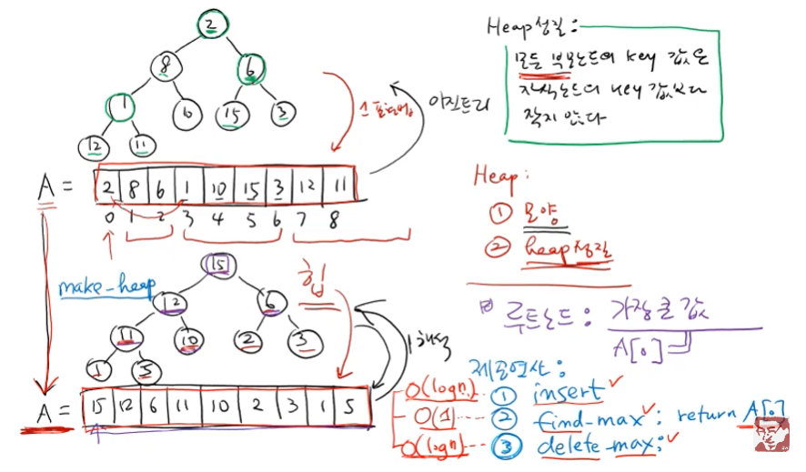

1. 모양

2. heap 성질
- 위 두 가지 성질을 모두 만족할 때 이를 Heap이라고 부름

- 루트노드A[0] : 가장 큰 값이 들어 있게 됨

- 제공연산
  
  - make-heap : 어떤 입력값을 heap 상태로 만들어주는 것
  
  - insert : insert할 때마다 그 값이 힙 성질을 만족하도록 자리를 찾아들어가야함
  
  - find-max : return A[0] → max값을 빠르게 알고 싶을 때 힙을 사용하는 이유
  
  - delete-max : max값을 지우고 남은 값들도 힙을 유지할 수 있음

## <힙 make_heap연산>

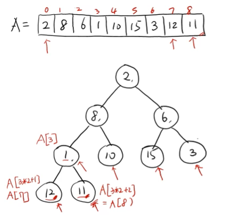

- make_heap : heapify-down이라는 연산을 계속해서 반복수행

- **맨 마지막에 있는 노드부터 루트노드까지 돌며 힙 성질을 만족하는 위치로 보내주는것**

- 내 자식 노드가 나보다 크다면, 그 둘 중 더 큰 노드와 자리를 바꿔줌

- 연산 과정 설명
  
  - A[3]에 있는 1의 왼쪽 자식노드 A[7], 오른쪽 자식노드 A[8]을 비교했더니 둘다 1보다 큰 값, 둘 중 값이 더 큰 12와 1의 자리를 바꿔준다. A[3]이 12, A[7]이 1이 됨
    
    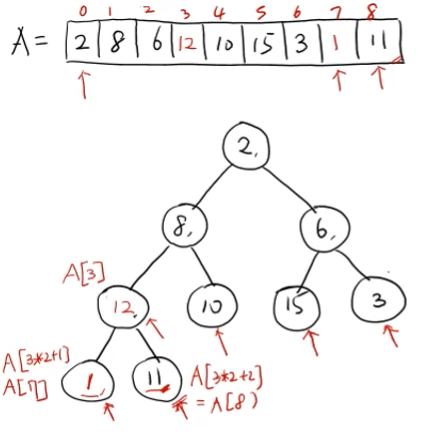
  
  - A[2]에 있는 6의 왼쪽 자식노드 A[5], 오른쪽 자식노드 A[6]을 비교했더니 A[5]의 값 15가 6보다 크므로 둘의 자리를 바꿔준다. A[2]가 15, A[5]가 6이 됨
    
    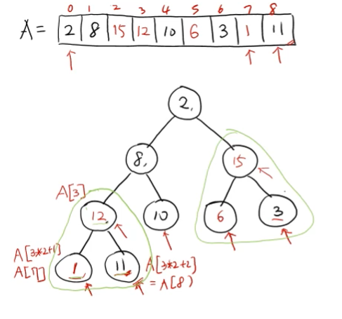
  
  - A[1]에 있는 8의 왼쪽 자식노드 A[3], 오른쪽 자식노드 A[4]를 비교했더니 둘다 8보다 큰 값, 둘 중 값이 더 큰 12와 8의 자리를 바꿔준다. 하지만 A[3]에는 자식노드가 존재하므로 그 자식 노드들도 힙 성질을 만족하는지 확인해 주어야 함. A[7]은 1로 8보다 작지만, A[8]이 11로 8보다 크므로 둘의 자리를 바꿔준다. 8이 리프노드인 A[8]까지 내려왔으므로 종료. 결론적으로 A[1]은 12, A[3]은 11, A[8]은 8이됨
    
    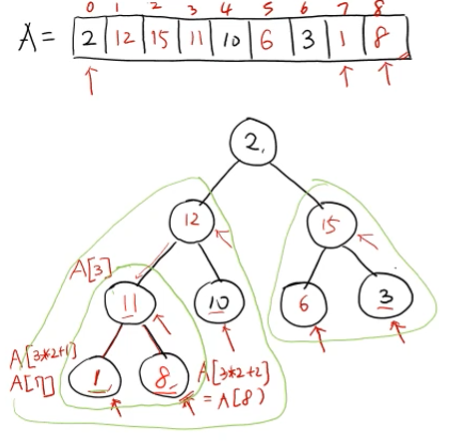
  
  - A[0]에 있는 2의 왼쪽 자식노드 A[1], 오른쪽 자식노드 A[2]를 비교했더니 둘다 2보다 큰 값이므로 둘 중 값이 더 큰 15와 2의 자리를 바꿔준다. A[2]에는 자식노드가 있으므로 자식 노드인 A[5], A[6]과도 비교해주어야 함. 둘다 2보다 큰 값이므로 둘 중 더 큰 값인 6과 자리를 바꿔주어야 함. 2가 리프노드인 A[5]까지 내려오면 연산 종료. A[0]는 15, A[2]는 6, A[5]는 2가 된다. 
    
    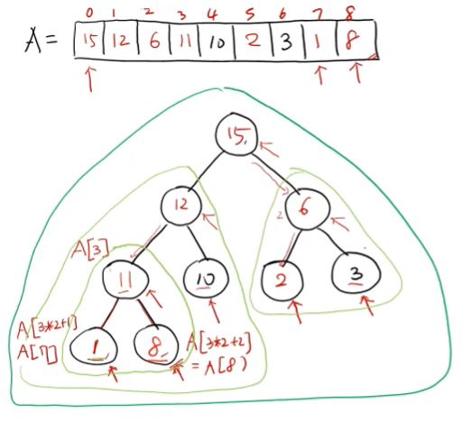

### make_heap 연산 sudo코드

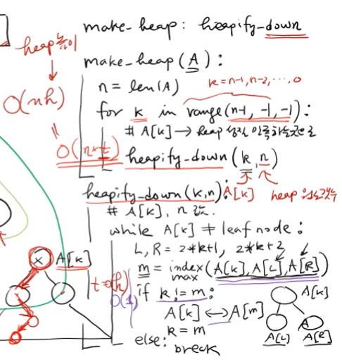

- make_heap(A) : A에 들어있는 값들을 힙 성질을 만족하도록 바꿔주는 방법 **O(nh)**
  
  - A의 가장 마지막 원소부터 첫 원소까지 for문을 돌면서 (k)
  
  - A[k]를 heap성질을 만족하는 곳으로 내려보냄 : heapify-down(k, n)

- heapify-down(k, n) : k를 힙 성질 만족하는 곳으로 내려보내는 것 **O(h)**
  
  - A[k]가 리프노드이거나 자식 노드에 있는 값이 자기보다 작을때까지 반복!1
  
  - A[k] != 리프노드일 때
  
  - A[k], A[L], A[R] 중 가장 큰 값을 갖는 노드의 인덱스를 m이라고 하자
  
  - k가 m과 다를 경우 : 자식노드가 A[k]보다 크다는 뜻이므로 A[m]과 자리 교환 후 k를 m으로 재할당해줌(while문으로 반복수행 해야하므로)
  
  - k가 m과 같은 경우 : A[k]가 가장 큰값이므로 while문 break

### n개의 노드를 가진 힙의 높이 h <= log₂n

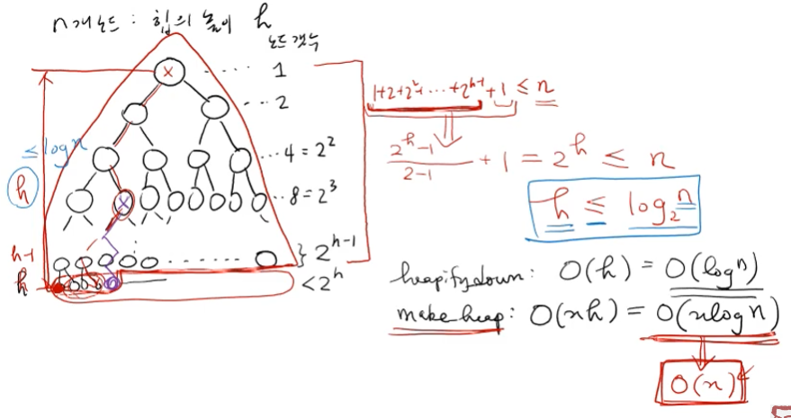

- heapify-down : O(h) = O(logn)

- make-heap : O(nh) = O(nlogn)

- leaf 노드에 가까운 노드에서 heapify-down을 수행하면 사실 O(logn)만큼의 시간도 소요되지 않음! 따라서 make-heap의 수행시간은 O(n)이라고 할 수 있음!

## <힙 insert/delete_max연산>

### insert 연산

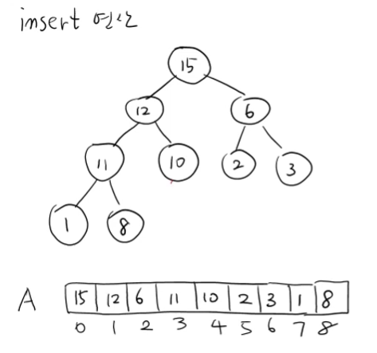

- insert : 이미 생성되어있는 힙에 어떤 값을 힙 성질을 만족할 수 있도록 넣어주는 연산

- 삽입한 노드의 부모 노드가 더 작으면 자리를 바꿔주는 식으로 반복 수행

- 연산과정 설명-insert(14)
  
  - A.append(14)
  
  - A.heapify_up(9) : 해당 인덱스의 노드부터 부모노드로 올라가며 부모 노드의 값이 더 작을 경우 자리를 바꿔주는 연산 수행
    
    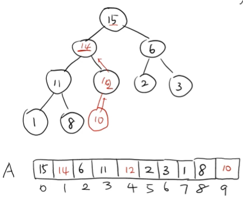
  
  - heapify_up(k) :

### insert 연산 sudo코드

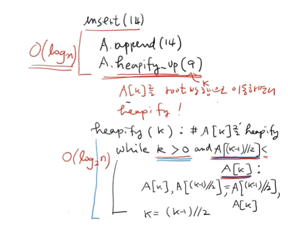

- heapify_up(k) : A[k]를 root 방향으로 이동하면서 heapify **O(log₂n)**
  
  - k가 루트노드가 아니고, 해당 노드의 값이 부모노드보다 큰 동안 반복수행
  
  - A[k]와 A[(k-1)//2]의 자리를 바꿔주고
  
  - k를 부모노드의 인덱스로 바꿔줌

- 어떤 A를 힙으로 만들어주고 싶다면, make_heap연산<O(n)>을 수행하거나, insert를 n번 수행<O(nlogn)>하면 된다. 하지만 O(n)이 더 빠르므로 make_heap 수행하는게 합리적

### find_max/delete_max 연산

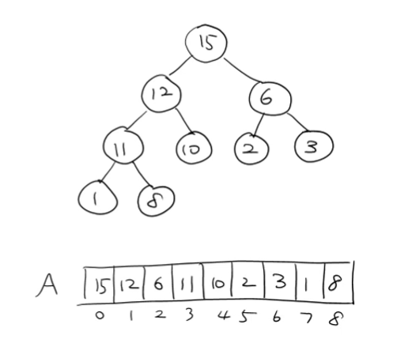

- find_max : return A[0] **O(1)**

- delete_max : heapify-down(0, n) 연산 수행 **O(logn)**
  
  - A[0] 삭제, 루트노드가 없어지므로 이를 채워주어야함
  
  - 가장 마지막에 있던 A[8]이 A[0]로 올라와서 자리를 채워줌
    
    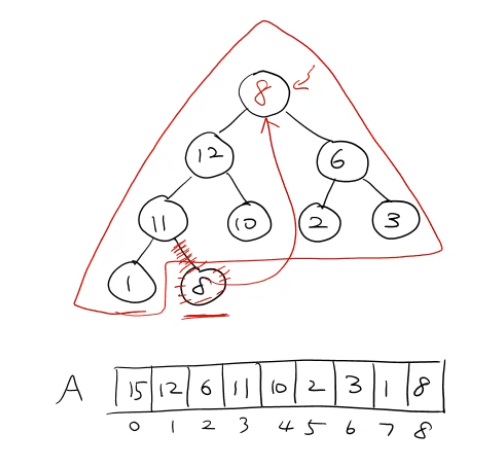
  
  - 힙 성질을 만족하지 않기 때문에 만족할때까지 자리를 이동시켜주어야 함
  
  - 8의 자식노드인 A[1], A[2]와 비교했을 때 왼쪽 자식노드인 A[1]이 12로 더 크기 때문에 자리를 변경해줌
    
    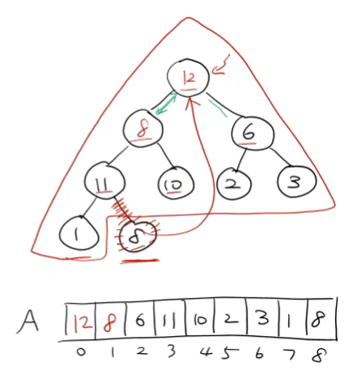
  
  - A[1] 자리에 온 8의 자식노드인 A[3], A[4]와 비교했을 때 둘 모두 8보다 크기 때문에, 그 중 더 큰 값인 A[3], 11과 자리를 바꿔줌
    
    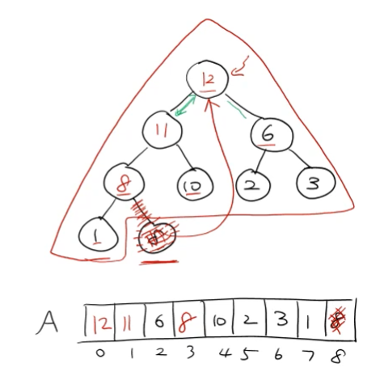
  
  - A[3] 자리에 온 8의 자식노드 A[7]과 비교했을 때, 8이 더 크므로 자리변경X

### delete_max 연산 sudo코드

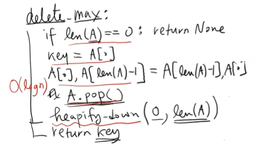

- key에 A[0] (max값) 저장, 이 값과 가장 마지막 노드의 값을 바꿔준 후 A.pop()

- heapify_down(0, len(A)) 연산 수행

## <힙 heap 정리>

### max_heap

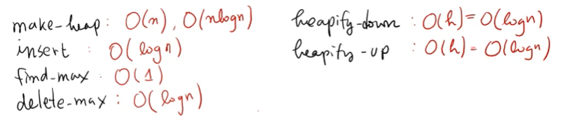

### min_heap : heapify_down 연산 수행 시 swap을 반대로 하면됨

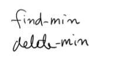
