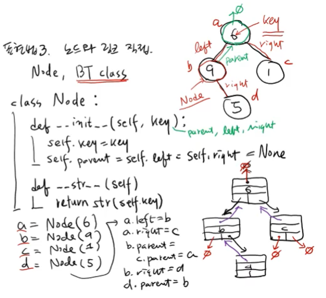
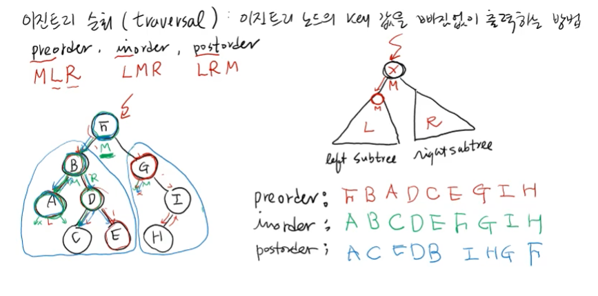
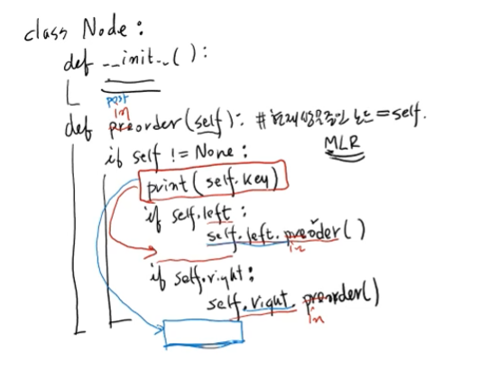
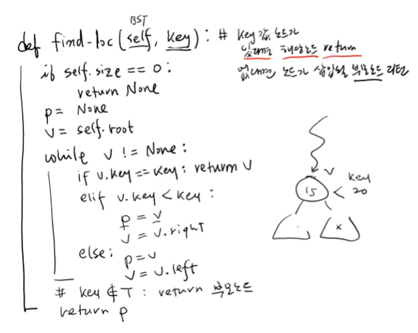
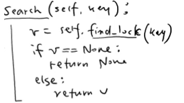
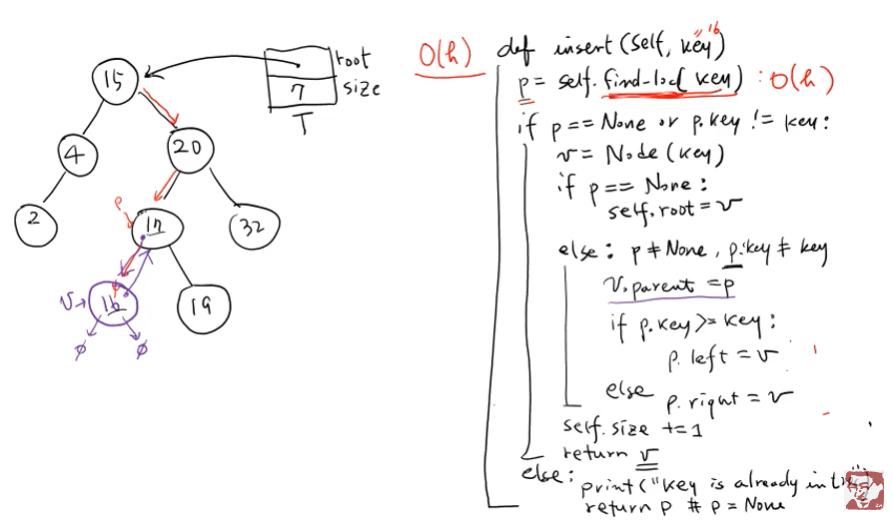

# Week6_이진트리(Binary Tree)

## <이진트리 정의와 순회>

- 이진트리를 표현할 수 있는 방법 3가지 중 첫번째 방법
  
  - 배열, 리스트에 모든 노드를 표시하되, 빈 노드는 None으로 처리
  
  - 각각의 레벨에 있는 노드들이 왼쪽부터 연속적으로 리스트에 배치됨
  
  - 대표적인 게 힙!

- 이진트리를 표현할 수 있는 방법 3가지 중 세번째 방법
  
  
  
  - Node, BT 클래스 선언 → 노드와 링크를 직접적으로 표현
    
    - 노드클래스는 각각 key값을 가지고, left와 right 자식노드를 나타내는 링크가 있음
    
    - 루트노드를 제외한 각 노드는 모두 parent를 가짐
    
    - parent가 None이면 그 노드가 루트노드!

### 이진트리 순회(traversal)

- 이진트리 노드의 key값을 빠짐없이 출력하는 방법

- preorder / inorder / postorder 3가지 방법이 있음 (M의 위치에 따라)

- 세 가지 방법 모두 L을 R보다 먼저 방문한다는 특징

### 이진트리 순회 sudo코드

- print 위치만 달라진다는 점 주의!

## <이진탐색트리 정의, 탐색, 삽입 연산>

없는 부분 노트북에 저장되어 있으니까 나중에 pull 땡겨서 합치기...!

### 이진탐색트리 Search 연산 sudo코드

- **BST의 key값을 찾는 find_loc 함수** : key값을 갖는 노드가 있다면 해당 노드 return, 
  없다면 노드가 삽입될 부모노드 리턴
  
  - BST의 사이즈가 0이라면(빈 트리라면) 부모노드가 없다는 뜻이므로 None 리턴
  
  - p는 v의 부모, 루트노드부터 시작해야하므로 v는 self.root/p는 None으로 초기화
  
  - v가 None이 아닌동안 v.key값과 내가 찾고 싶은 key값 비교 수행
    
    - v.key == key : 값을 찾은거! 해당노드(v) 리턴
    
    - v.key < key : 오른쪽 노드로 내려가야함! p를 v로, v를 v.right로 재설정
    
    - else : 왼쪽 노드로 내려가야함! p를 v로, v를 v.left로 재설정
  
  - while문 빠져나오면 트리에 key값이  없다는 뜻이므로 부모노드(p) return

- Search 연산 : 사실 find_loc 함수랑 똑같음! 이름만 Search로 바꿔준거

### 이진탐색트리 insert 연산 sudo코드

- insert(16) **O(h)** → h가 작을수록 insert연산 수행시간이 짧아진다
  
  - p = find_loc(16) : 17을 가리키게됨
  
  - p가 None이거나 p.key가 key와 다를 때
    
    - v = Node(16) : 16을 값으로 갖는 노드 v 하나 만들어주기
      
      - p가 None이면 v가 루트노드라는 뜻 : selt.root = v
      
      - 아니면 p의 자식노드에 v를 넣어줘야함(왼쪽/오른쪽은 아직 모름)
        :  v.parent = p (v의 부모노드를 p로 설정해 줌)
        p.key가 나보다 크면 왼쪽자식 노드에 v넣어주기 : p.left = v
        p.key가 나보다 작으면 오른쪽자식 노드에 v넣기 : p.right = v
    
    - size += 1
    
    - 새로 삽입된 노드 v 리턴 (나중에 이걸 받아서 다른 연산을 할 일이 있을수있음)
  
  - else: key가 중복된다는 뜻이므로 이미 트리에 키가 존재한다는 메시지 출력, p 리턴

## <이진탐색트리 삭제 연산>
